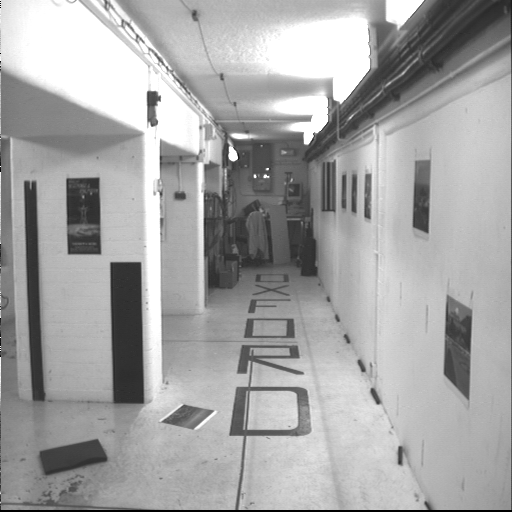
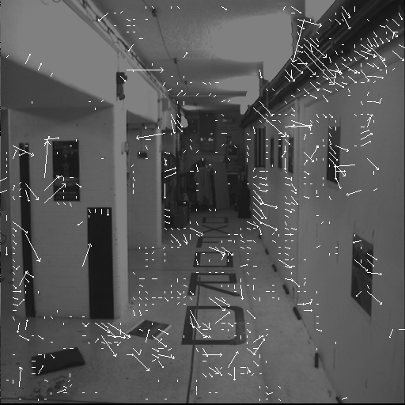
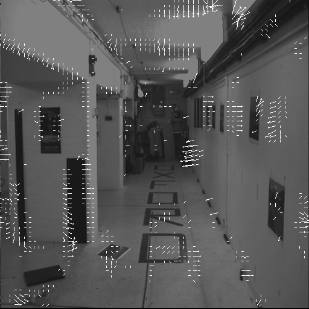
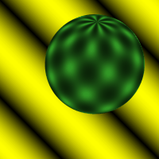
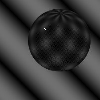
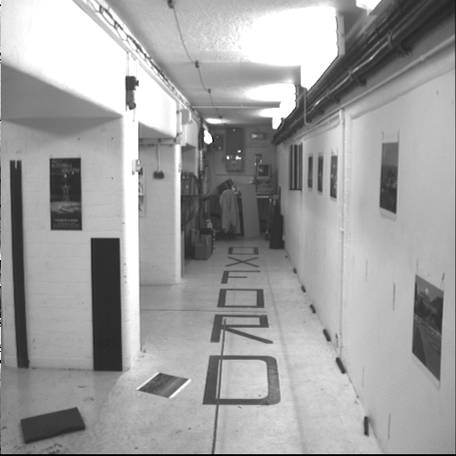
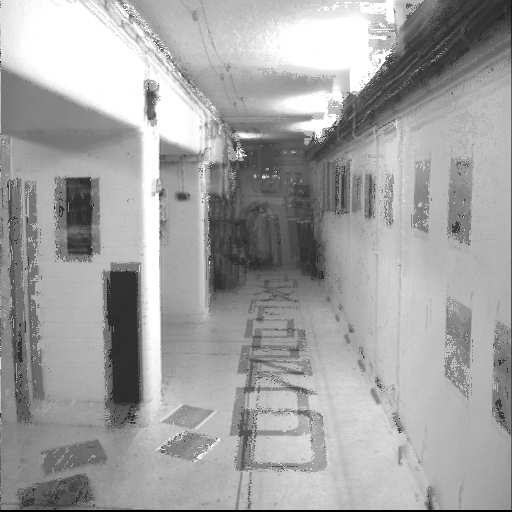
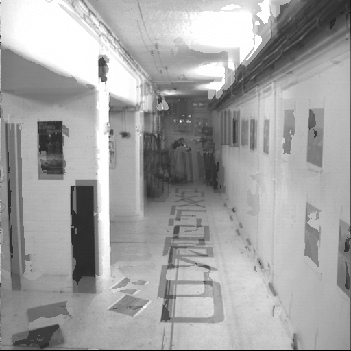
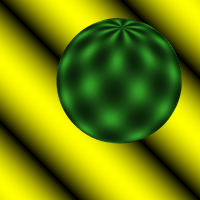
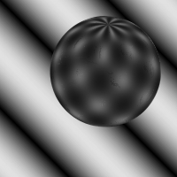

  [![Contributors][contributors-shield]][contributors-url] [![Forks][forks-shield]][forks-url] [![Stargazers][stars-shield]][stars-url] [![Issues][issues-shield]][issues-url] [![MIT License][license-shield]][license-url] [![LinkedIn][linkedin-shield]][linkedin-url]

<!-- PROJECT LOGO -->
<br />

<p align="center">
  <h3 align="center">Video Interpolation using Optical Flow</h3>
  <p align="center">
    Intermediate frame interpolation using optical flow with FlowNet2
    <br />
    <a href=https://github.com/vineeths96/Video-Interpolation-using-Optical-Flow><strong>Explore the repository»</strong></a>
    <br />
    <br />
    <a href=https://github.com/vineeths96/Video-Interpolation-using-Optical-Flow/blob/master/Problem_Statement.pdf>View Problem Statement</a>
    <a href=https://github.com/vineeths96/Video-Interpolation-using-Optical-Flow/blob/master/results/report.pdf>View Report</a>
  </p>

</p>

> tags : frame interpolation, optical flow, lucas kande, multiscale, horn schunk, digital video, deep learning, pytorch


<!-- ABOUT THE PROJECT -->

## About The Project

This project deals with the task of video frame interpolation with estimated optical flow. In particular, we estimate the forward optical flow (flow from Frame *N* to Frame *N + 2*) and the backward flow (flow from Frame *N + 2* to Frame *N*) and use both of them to estimate the intermediate Frame *N*. To estimate the optical flow we three popular methods — Lucas-Kanade algorithm, Multiscale Lucas-Kanade algorithm (with iterative tuning) and Discrete Horn-Schunk algorithm. We explore the interpolation performance on [Sphere](./input/sphere) dataset and [Corridor](./input/corridor) dataset.  We observe that the quality of interpolated frames is comparable to original with Sphere datasets and is poor for Corridor dataset. A detailed description of interpolation algorithms and analysis of the results are available in the [Report](./results/report.pdf).


### Built With
This project was built with 

* python v3.8.5
* The environment used for developing this project is available at [environment.yml](environment.yml).


<!-- GETTING STARTED -->

## Getting Started

Clone the repository into a local machine using

```shell
git clone https://github.com/vineeths96/Video-Interpolation-using-Optical-Flow
```

### Prerequisites

Create a new conda environment and install all the libraries by running the following command

```shell
conda env create -f environment.yml
```

The dataset used in this project is already available in this repository. To test on other datasets, download them and put them in the `input/` folder.

### Instructions to run

We explore three popular methods — Lucas-Kanade algorithm, Multiscale Lucas-Kanade algorithm (with iterative tuning) and Discrete Horn-Schunk algorithm.

##### Lucas-Kanade Optical Flow Algorithm

To interpolate the frame with the Lucas-Kanade algorithm, run the following command. This will interpolate the intermediate frames and store it in [this](./results/lucas_kanade/interpolated_frames) folder.

```shell
python lucas_kanade_interpolation.py
```

##### Multiscale Lucas-Kanade Optical Flow Algorithm

To interpolate the frame with the Multiscale Lucas-Kanade algorithm, run the following command. This will interpolate the intermediate frames and store it in [this](./results/multiscale_lucas_kanade/interpolated_frames) folder.

```shell
python multiscale_lucas_kanade_interpolation.py
```

##### Discrete Horn-Schunck Optical Flow Algorithm

To interpolate the frame with the Discrete Horn-Schunck algorithm, run the following command. This will interpolate the intermediate frames and store it in [this](./results/horn_schunck/interpolated_frames) folder.

```shell
python horn_schunck_interpolation.py
```


<!-- RESULTS -->

## Results

**Note that the GIFs below might not be in sync depending on the network quality. Clone the repository to your local machine and open them locally to see them in sync.**

A detailed description of algorithms and analysis of the results are available in the [Report](./results/report.pdf).

The plots below shows the estimated optical flow for the datasets with the Lucas-Kanade method and the Horn-Schunck method. We can see that there are significant change in the estimated optical flow between the two methods.  This is because Lucas-Kanade method imposes local smoothness constraint and Horn-Schunck method imposes global smoothness constraints.

|             Corridor Dataset             |                Lucas-Kanade Optical Flow                |                Horn-Schunck Optical Flow                |
| :--------------------------------------: | :-----------------------------------------------------: | :-----------------------------------------------------: |
|  |  |  |

|            Sphere Dataset            |              Lucas-Kanade Optical Flow              |              Horn-Schunck Optical Flow              |
| :----------------------------------: | :-------------------------------------------------: | :-------------------------------------------------: |
|  |  |  |


The plots below shows the interpolated frames for the datasets with the Lucas-Kanade method, Multiscale Lucas-Kanade method, and Horn-Schunck method. We can see that there is the quality of interpolated frames for the Sphere dataset is comparable to the original whereas that of Corridor dataset is quite poor.

|             Corridor Dataset Ground Truth             |              Lucas-Kanade Interpolated Frame               |         Multi-Scale Lucas-Kanade Interpolated Frame          |              Horn-Schunck Interpolated Frame               |
| :---------------------------------------------------: | :--------------------------------------------------------: | :----------------------------------------------------------: | :--------------------------------------------------------: |
|  |  |  |  |

|            Sphere Dataset Ground Truth            |            Lucas-Kanade Interpolated Frame             |       Multi-Scale Lucas-Kanade Interpolated Frame        |            Horn-Schunck Interpolated Frame             |
| :-----------------------------------------------: | :----------------------------------------------------: | :------------------------------------------------------: | :----------------------------------------------------: |
|  |  |  |  |


<!-- LICENSE -->

## License

Distributed under the MIT License. See `LICENSE` for more information.


<!-- CONTACT -->
## Contact

Vineeth S - vs96codes@gmail.com

Project Link: [https://github.com/vineeths96/Video-Interpolation-using-Optical-Flow](https://github.com/vineeths96/Video-Interpolation-using-Optical-Flow)


<!-- ACKNOWLEDGEMENTS -->
## Acknowledgements

* [NVIDIA FlowNet2](https://github.com/NVIDIA/flownet2-pytorch)

  > Fitsum Reda et al. flownet2-pytorch: Pytorch implementation of FlowNet 2.0: Evolution of Optical Flow Estimation
  > with Deep Networks. https://github.com/NVIDIA/flownet2-pytorch . 2017.


<!-- MARKDOWN LINKS & IMAGES -->
<!-- https://www.markdownguide.org/basic-syntax/#reference-style-links -->

[contributors-shield]: https://img.shields.io/github/contributors/vineeths96/Video-Interpolation-using-Optical-Flow.svg?style=flat-square
[contributors-url]: https://github.com/vineeths96/Video-Interpolation-using-Optical-Flow/graphs/contributors
[forks-shield]: https://img.shields.io/github/forks/vineeths96/Video-Interpolation-using-Optical-Flow.svg?style=flat-square
[forks-url]: https://github.com/vineeths96/Video-Interpolation-using-Optical-Flow/network/members
[stars-shield]: https://img.shields.io/github/stars/vineeths96/Video-Interpolation-using-Optical-Flow.svg?style=flat-square
[stars-url]: https://github.com/vineeths96/Video-Interpolation-using-Optical-Flow/stargazers
[issues-shield]: https://img.shields.io/github/issues/vineeths96/Video-Interpolation-using-Optical-Flow.svg?style=flat-square
[issues-url]: https://github.com/vineeths96/Video-Interpolation-using-Optical-Flow/issues
[license-shield]: https://img.shields.io/badge/License-MIT-yellow.svg
[license-url]: https://github.com/vineeths96/Video-Interpolation-using-Optical-Flow/blob/master/LICENSE
[linkedin-shield]: https://img.shields.io/badge/-LinkedIn-black.svg?style=flat-square&logo=linkedin&colorB=555
[linkedin-url]: https://linkedin.com/in/vineeths

